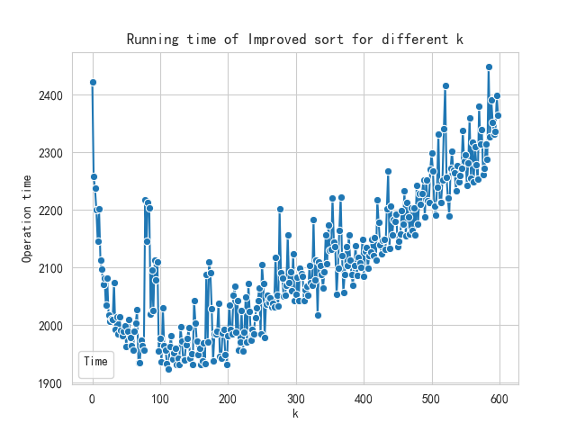
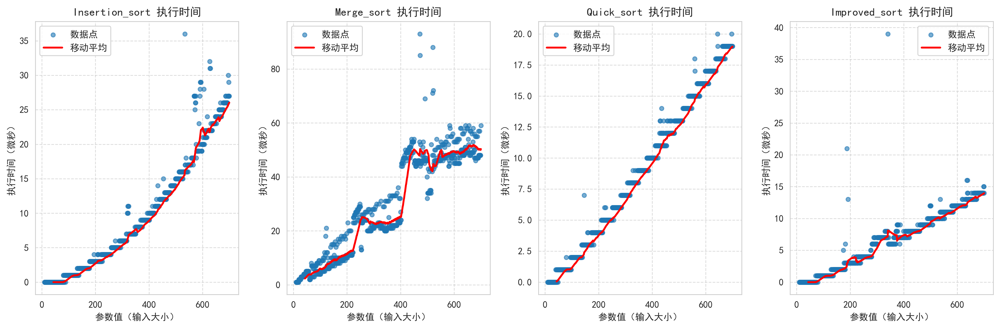
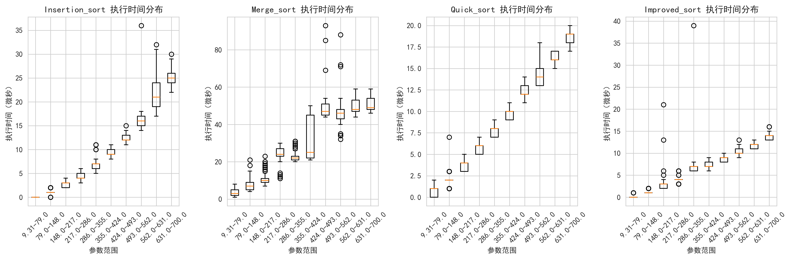
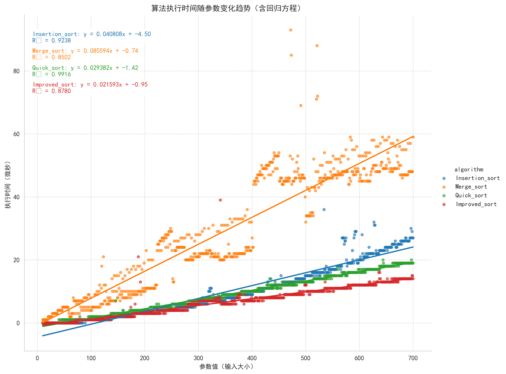

### Data Structure Project I: Sort and Complexity
Shiqiang Wu 24300810019@m.fudan.edu.cn
#### I. Project Structure
+ cpp_code: contains all C++ implementation of sort algorithms
   + benchmark.cpp
    code to generate random data to sort and output the result(operating time) to `result.csv`
   + **my_algorithm.h**
    implementation of `insertion sort`, `merge sort`, `quick sort`, `improved sort`
     
    including ***q1***, ***q2***, ***q3***, ***q5***
   + sort_test.cpp
    some test samples to justify the correctness of different sort algorithms
+ scripts: python scripts to run the sort algorithms and visualize the results
   + run_benchmarks.py
    script used to run the `benchmark.cpp`
   + visualize_results.py
    generate the visualization of the operation time
   + check_environment.py 
    check the environment
+ data: `csv` file to record the result and some graphs
   + results.csv  
      operation time of different sort algorithm
   + qs_results.csv
      opertation time of **improved sorts** choosing different `k`
   + execution_time_boxplot.png
   + execution_time_plot.png
   + execution_time_regression.png

#### II. Dependence Packages and Operation Workflow
1. dependence packages:
   `pandas`, `matplotlib`, `seaborn`, `numpy`
2. operation workflow:
   + step0: check environment
   ```bash
      cd scripts
      python check_environment.py
   ```
   + step1: test sort algorithms correctness
   ```bash
      cd ../cpp_code
      g++ sort_test.cpp -o sort_test
      ./sort_test
   ``` 
   which should show this:
   ```bash
   Merge_sort Int: 0 1 2 2 3 4 5 5 7 8 9 
   Quick_sort Int: 0 1 2 2 3 4 5 5 7 8 9 
   Improved_sort Int: 0 1 2 2 3 4 5 5 7 8 9 
   Merge_sort Float: 0.4 1.2 1.7 2 2.5 3 3.1 3.3 6.5 8.2 9.1 
   Quick_sort Float: 0.4 1.2 1.7 2 2.5 3 3.1 3.3 6.5 8.2 9.1 
   Improved_sort Float: 0.4 1.2 1.7 2 2.5 3 3.1 3.3 6.5 8.2 9.1 
   Merge_sort Char: $ A F J K T U _ a b f s 
   Quick_sort Char: $ A F J K T U _ a b f s 
   Improved_sort Char: $ A F J K T U _ a b f s 
   ```
   + step2: run the test and visualize the operation time
   ```bash
      cd ../scripts
      python run_benchmarks.py
   ```
#### III. Operation Time of Different Algorithms and Reflection

figure1: execution time plot(10-500)


figure2: time bloxplot(10-500)


figure3: time regression plot and comparison of different algorithm(10-500)


figure4: execution time plot(1000-50000)


figure5: time bloxplot(1000-50000)


figure6: time regression plot and comparison of different algorithm(1000-50000)

1. Compare the performance of Quick sort and Insertion sort(with tiny scale data)
   In figure 1-3, we compare algorithms with tiny scale data(size range from 10 to 500, step=1), for each size we repeat the experiment with 10 times and get the average result to reduce the randomness error.Notice that in figure3, we use the linear regression to fit the curves of different algorithms.

   Here is the linear fit functions:

   Insertion sort:
   $$y= 0.031649x - 2.31$$
   
   Quick sort:
   $$y= 0.028215x - 1.11$$

   We then can compute the point where Quick sort outperforms Insertion sort:
   $$x=349.45$$

   We may assume that if we construct our `improved sort`, we can simply end the quick sort at the scale of `k = 349` or so, and then switch to our insertion sort algorithm. Now let's do experiments to have our assumption examined.

   #### IV. Improved Sort k selection
   Our implementation of `Improved Sort` is simply a combination of quick sort and insertion sort.
   ```cpp
   template<typename T>
   void Improved_Sort_k(std::vector<T>& arr, int k){
   // To-Do: Implement the algorithm combining the quick sort and insertion sort
      Quick_sort_naive_k(arr, k);
      Insertion_sort(arr);
   }
   ```
   The key problem is the choice of k.
   We can try different `k` s.The visualization of the results(`qs_results.csv`) is as follows.
   
   We can find that when `k=120` or so the operation time is the shortest.This is different from the therotical calculation we made above of about `349`.One explanation may be that when we choose `k`, we not only need to consider the performance of two algorithms, but also need to take the number of subproblems we give to quick sort and the extent of sort in our array then using insertion sort.
   We then can set `k=120` to compare our improved sort with other algorithms

   #### V.How about Merge Sort?
   We haven't talk about the `Merge sort` yet, since in the experiment we find that in practice the `Merge sort` can't beat the `Insertion sort` , not to say `Quick_sort` and `Improved_sort` in the scale of data my laptop allows.  
   
   
   
   